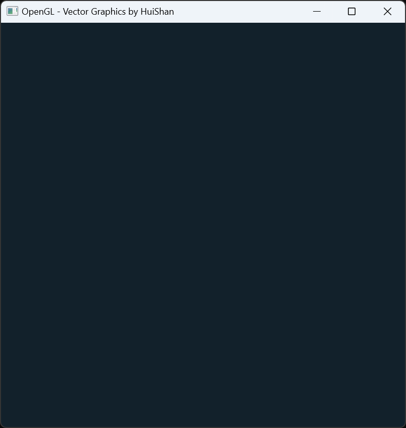
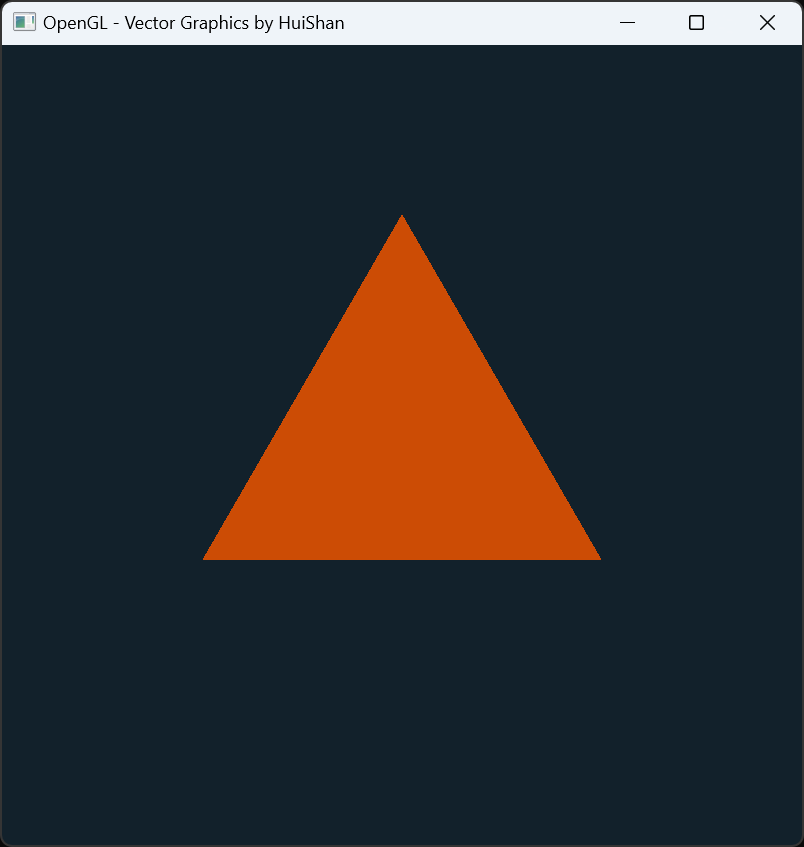
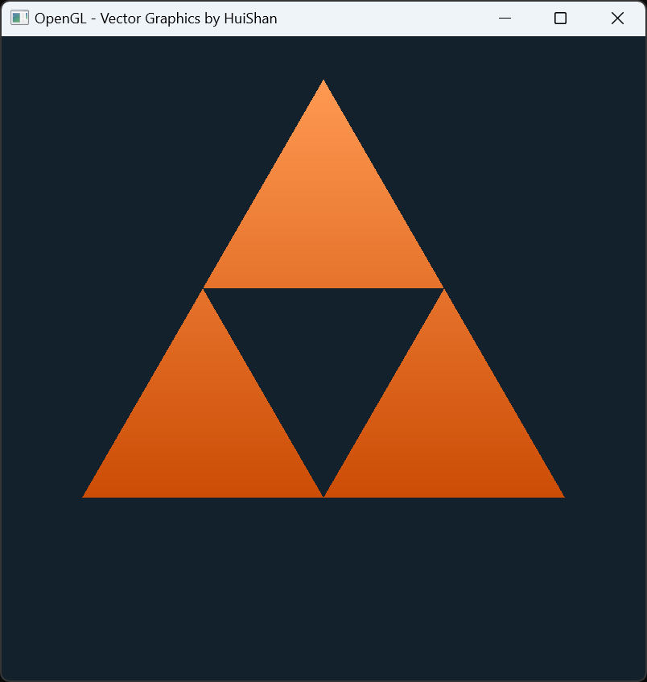
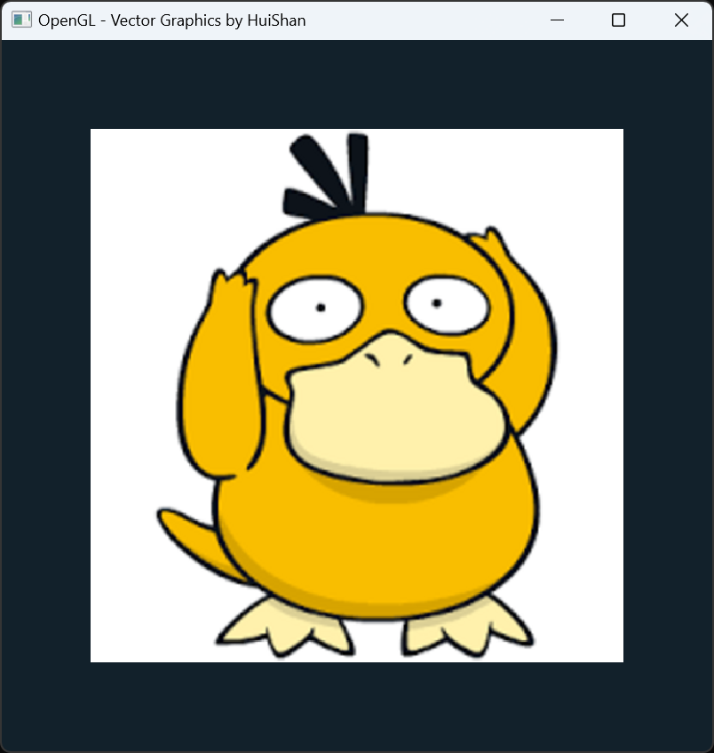
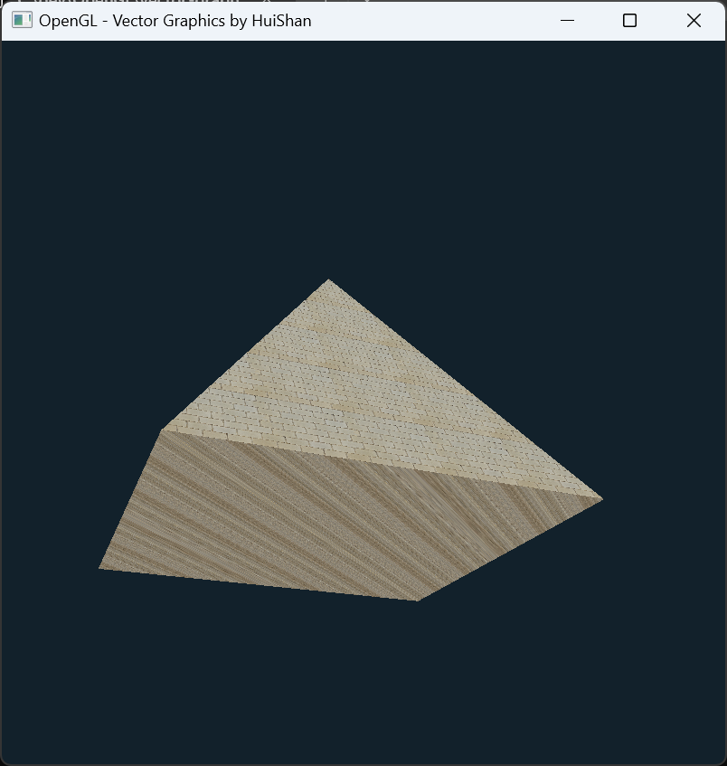
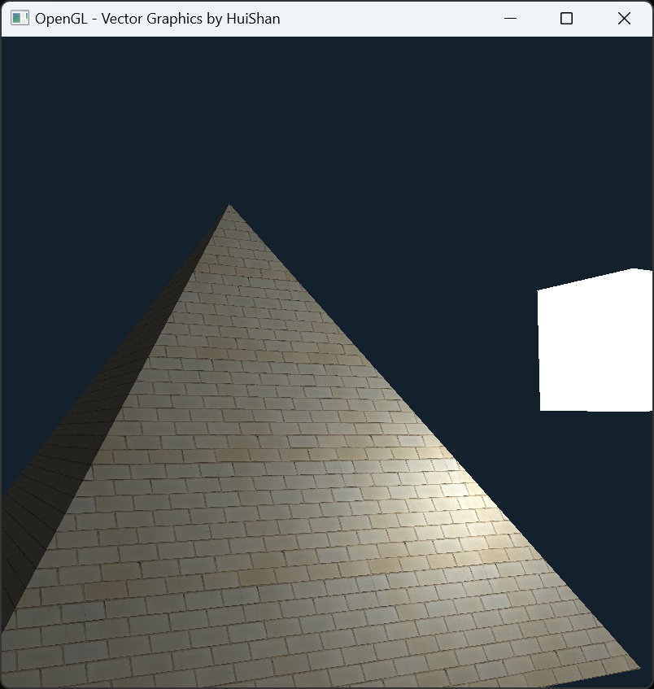

This repository contains my first OpenGL project, created while following an online tutorial. The goal of this project is to learn the basics of OpenGL, specifically focusing on rendering simple vector graphics.

## Task
- [x] OpenGL Course - Create 3D and 2D Graphics With C++ [video](https://www.youtube.com/watch?v=45MIykWJ-C4&t=5580s)
    - [x] Install
      - Source Download:
        - [GLFW](https://www.glfw.org/)
        - [Glad](https://glad.dav1d.de/)
    - [x] Window  
          
    - [x] Triangle  
          
    - [x] Index Buffer (2024/09/15)  
          
    - [x] Organizing
    - [x] Shaders (2024/09/16)  
          
    - [x] Textures  
          
      - Source Download:
        - [stb_image.h](https://github.com/nothings/stb/blob/master/stb_image.h) 
    - [x] Going 3D (2024/09/17)  
          
      - Source Download:
        - [GLM](https://github.com/g-truc/glm)
    - [x] Camera (2024/09/18)  
          
    - [x] Lighting (2024/09/19)  
          
    - [x] Specular Maps (2024/09/20)  
          
    - [x] Types of Light  
          
    - [x] Mesh Class (2024/09/22)  
          
    - [x] Model Loading (2024/09/23)  
          
      - Source Download:
        - [json](https://github.com/nlohmann/json/blob/develop/include/nlohmann/json.hpp)
